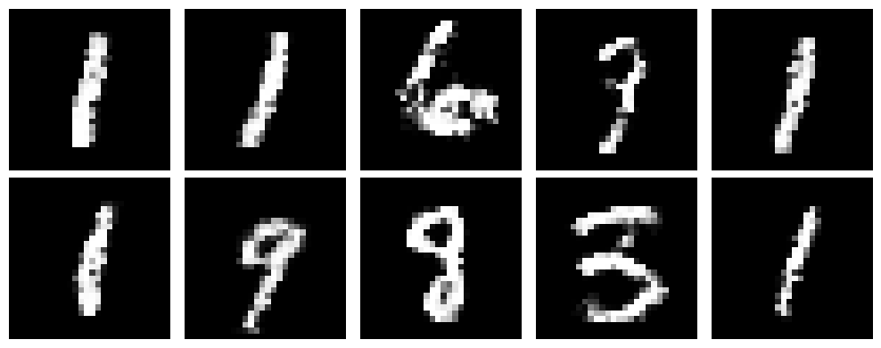

# pytorch-GANs
PyTorch implementations of various GAN papers/architectures like GAN (Goodfellow at at.), DCGAN (Radford et al.), etc. 

## Implemented Papers

* [Generative Adversarial Networks (Goodfellow et al., 2014)](https://arxiv.org/abs/1406.2661)

## Generative Adversarial Networks (Goodfellow et al., 2014)
This code tries to reproduce the 2014 Goodfellow et al. paper [Generative Adversarial Networks](https://arxiv.org/abs/1406.2661).

#### MNIST (Fully-Connected)

| Epoch 001 | Epoch 100 |Loss |
| --------- | ---------- |-----------|
|  | | |

#### CIFAR-10 (Fully-Connected)


## Citations

```bibtex
@misc{goodfellow2014generativeadversarialnetworks,
      title={Generative Adversarial Networks}, 
      author={Ian J. Goodfellow and Jean Pouget-Abadie and Mehdi Mirza and Bing Xu and David Warde-Farley and Sherjil Ozair and Aaron Courville and Yoshua Bengio},
      year={2014},
      eprint={1406.2661},
      archivePrefix={arXiv},
      primaryClass={stat.ML},
      url={https://arxiv.org/abs/1406.2661}, 
}
```
