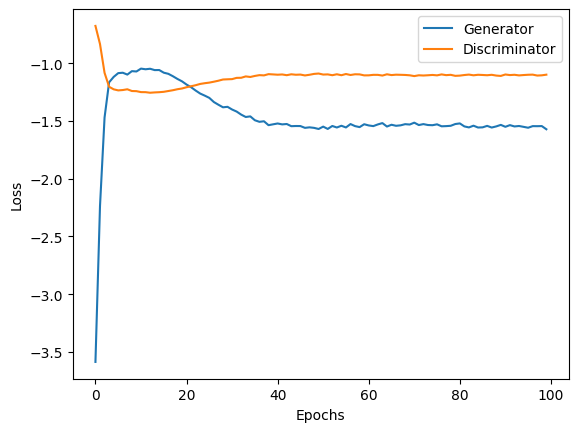

# pytorch-GANs
PyTorch implementations of various GAN papers/architectures like GAN (Goodfellow at at.), DCGAN (Radford et al.), etc. 

## Implemented Papers

* [Generative Adversarial Networks (Goodfellow et al., 2014)](https://arxiv.org/abs/1406.2661)

* [Unsupervised Representation Learning with Deep Convolutional Generative Adversarial Networks (Radford et al., 2016)](https://arxiv.org/abs/1511.06434)

* [Conditional Generative Adversarial Nets (Mirza et al., 2014)](https://arxiv.org/abs/1411.1784)

## Generative Adversarial Networks (Goodfellow et al., 2014)
This code tries to reproduce the 2014 Goodfellow et al. paper [Generative Adversarial Networks](https://arxiv.org/abs/1406.2661).

Original code and hyperparameters from the paper can be found [here](https://github.com/goodfeli/adversarial).

### MNIST (fully connected model)

#### Model Architecture:

Generator:
* Input layer: 100 units (Uniform[-1, 1] noise)
* Dense layer: 1200 units, ReLU
* Dense layer: 1200 units, ReLU
* Output layer: 784 units, Sigmoid

Discriminator:
* Input layer: 784 units (flattend 28x28 gray-scale image)
* Maxout layer: 240 units, 5 pieces
* Maxout layer: 240 units, 5 pieces
* Output layer: 1 unit, Sigmoid 

<div style="text-align: center;":>
      
</div>


| Epoch 001 | Epoch 100 |Loss |
| --------- | ---------- |-----------|
|  | | |

### CelebFaces (fully connected model)

#### Model Architecture:

Generator:
* Input layer:    100 units (Uniform[-1, 1] noise)
* Dense layer:    8000 units, ReLU
* Output layer:   2304 units, Sigmoid

Discriminator:
* Input layer: 2304 units (flattend 48x48 grayscale image)
* Maxout layer: 1200 units, 5 pieces
* Maxout layer: 1200 units, 5 pieces
* Output layer: 1 unit, Sigmoid 

<div style="text-align: center;":>
      
</div>

| Epoch 001 | Epoch 250 |Loss |
| --------- | ---------- |-----------|
|  | | |


## Deep Convolutional Generative Adversarial Networks (Radford et al. 2016)
This code tries to reproduce the 2016 Radford et al. paper [Deep Convolutional Generative Adversarial Networks](https://arxiv.org/abs/1511.06434).


*Figure 1: The architecture of the DCGAN generator used for CelebFaces modeling; Taken from Radford et al., 2016.*

#### CelebFaces (deep convolutional model)

<div style="text-align: center;":>
      
</div>

| Epoch 01 | Epoch 50 | Loss |
| --------- | ---------- | ------- | 
|  |  | |


*More images generated usinig DCGAN.*

##### About the CelebFaces dataset
The dataset was taken from kaggle.
Link to the dataset can be found [here](https://www.kaggle.com/datasets/jessicali9530/celeba-dataset).

Reproducibility:

Download the [CelebA dataset](https://mmlab.ie.cuhk.edu.hk/projects/CelebA.html) and place the images and attribute CSV in a folder called `celeba`.  

```python
dataset = CelebA(csv_file="list_attr_celeba.csv", root_dir="img_align_celeba", transform=...)
```


## Conditional Generative Adversarial Nets
This code tries to reproduce the 2014 Mirza et al. paper [Conditional Generative Adversarial Nets](https://arxiv.org/abs/1411.1784).


*Architecture of an conditional generative adversarial net; Taken from Mirza et al., 2014.*

#### MNIST (fully connected model)

<div style="text-align: center;":>
      
</div>

| Epoch 001 | Epoch 100 | Loss |
| --------- | ---------- | ------- | 
|  |  | |

## Citations

```bibtex
@misc{goodfellow2014generativeadversarialnetworks,
      title={Generative Adversarial Networks}, 
      author={Ian J. Goodfellow and Jean Pouget-Abadie and Mehdi Mirza and Bing Xu and David Warde-Farley and Sherjil Ozair and Aaron Courville and Yoshua Bengio},
      year={2014},
      eprint={1406.2661},
      archivePrefix={arXiv},
      primaryClass={stat.ML},
      url={https://arxiv.org/abs/1406.2661}, 
}
```

```bibtex
@misc{radford2016unsupervisedrepresentationlearningdeep,
      title={Unsupervised Representation Learning with Deep Convolutional Generative Adversarial Networks}, 
      author={Alec Radford and Luke Metz and Soumith Chintala},
      year={2016},
      eprint={1511.06434},
      archivePrefix={arXiv},
      primaryClass={cs.LG},
      url={https://arxiv.org/abs/1511.06434}, 
}
```

```bibtex
@misc{mirza2014conditionalgenerativeadversarialnets,
      title={Conditional Generative Adversarial Nets}, 
      author={Mehdi Mirza and Simon Osindero},
      year={2014},
      eprint={1411.1784},
      archivePrefix={arXiv},
      primaryClass={cs.LG},
      url={https://arxiv.org/abs/1411.1784}, 
}
```

```bibtex
@misc{liu2015celeba,
  title        = {CelebA: Large-scale CelebFaces Attributes Dataset},
  author       = {Z. Liu and P. Luo and X. Wang and X. Tang},
  year         = {2015},
  howpublished = {\url{https://www.kaggle.com/datasets/jessicali9530/celeba-dataset}},
  note         = {Original dataset by MMLAB, The Chinese University of Hong Kong},
  institution  = {Kaggle},
  keywords     = {face recognition, facial attributes, dataset}
}
```